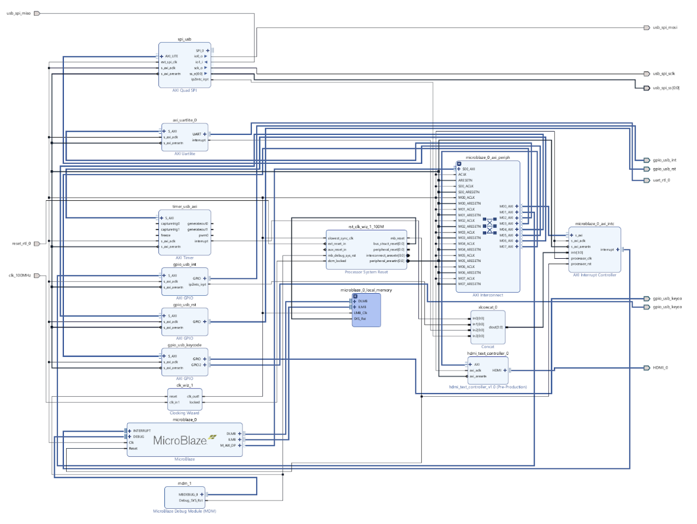
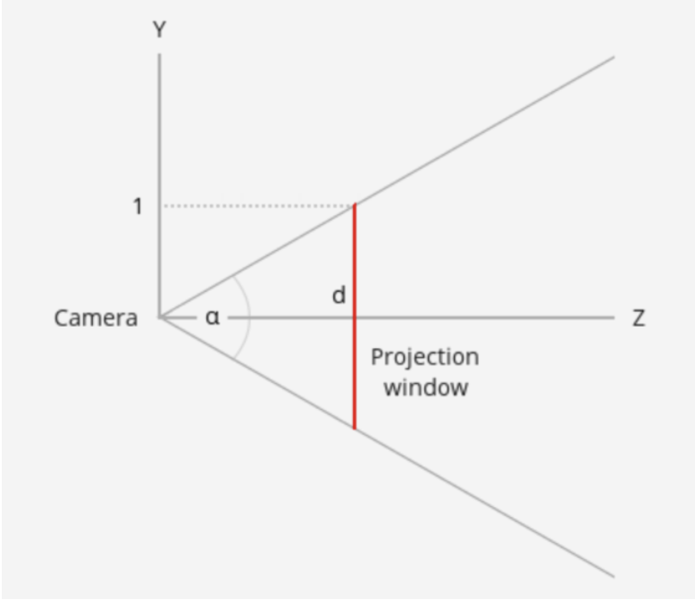
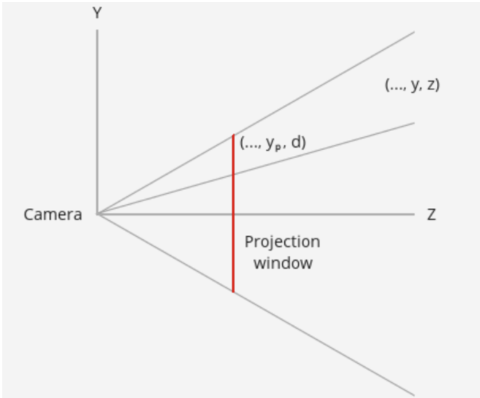
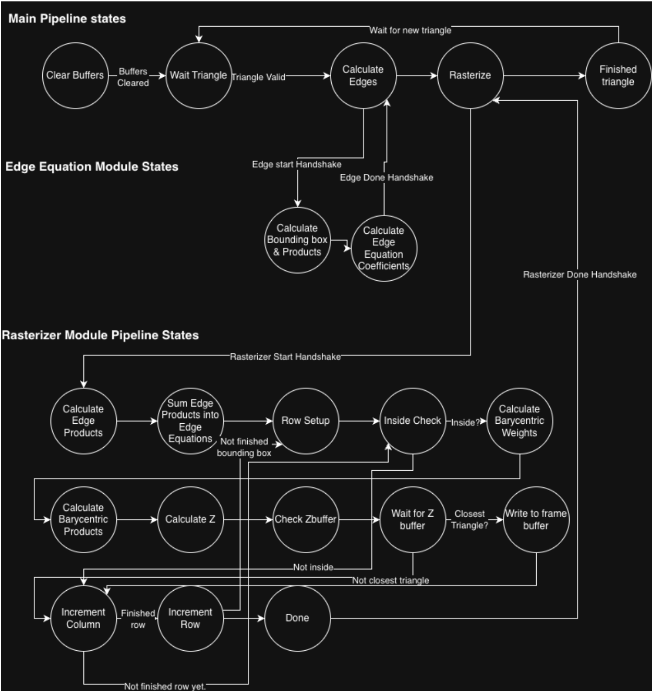
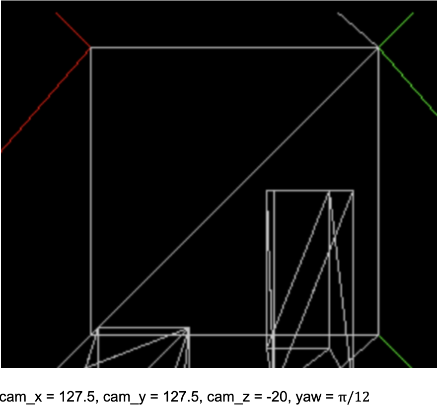
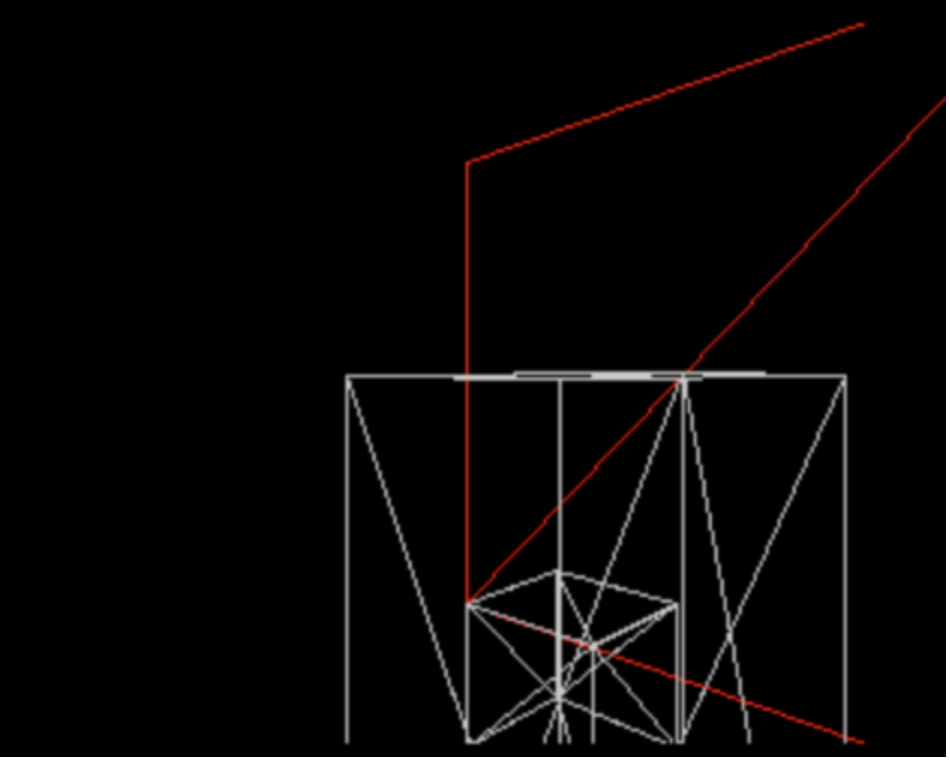
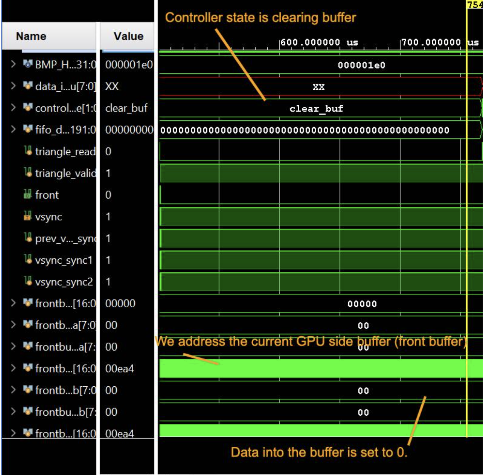
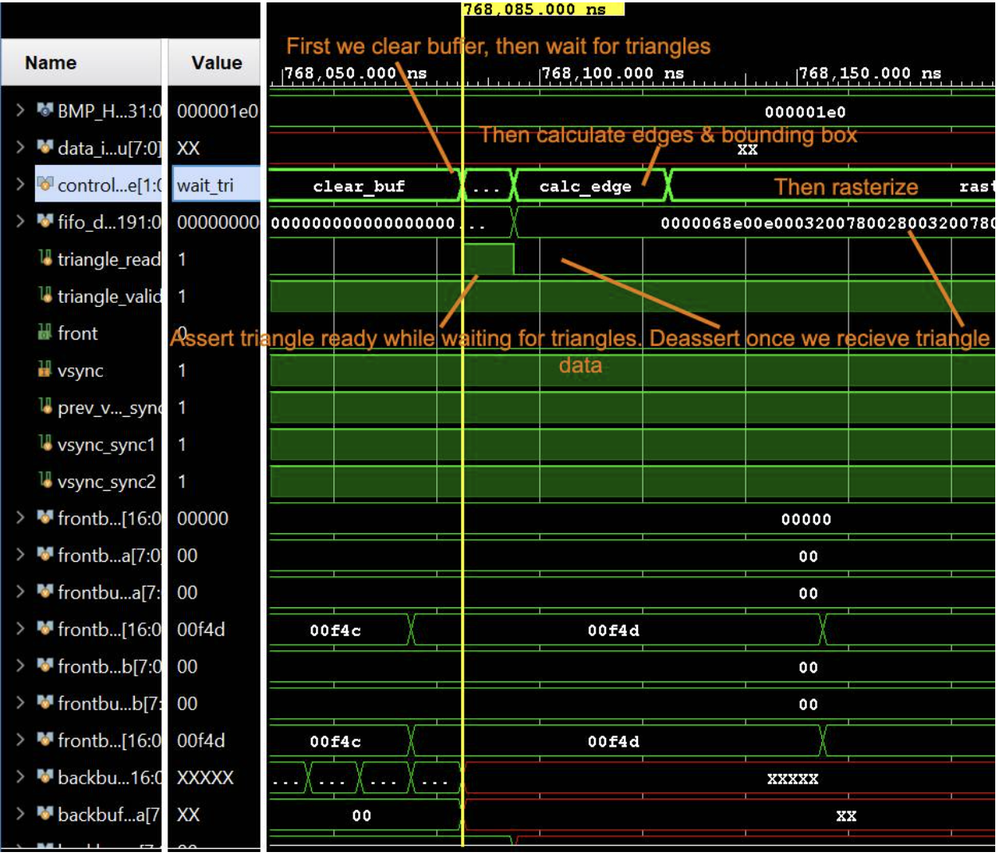
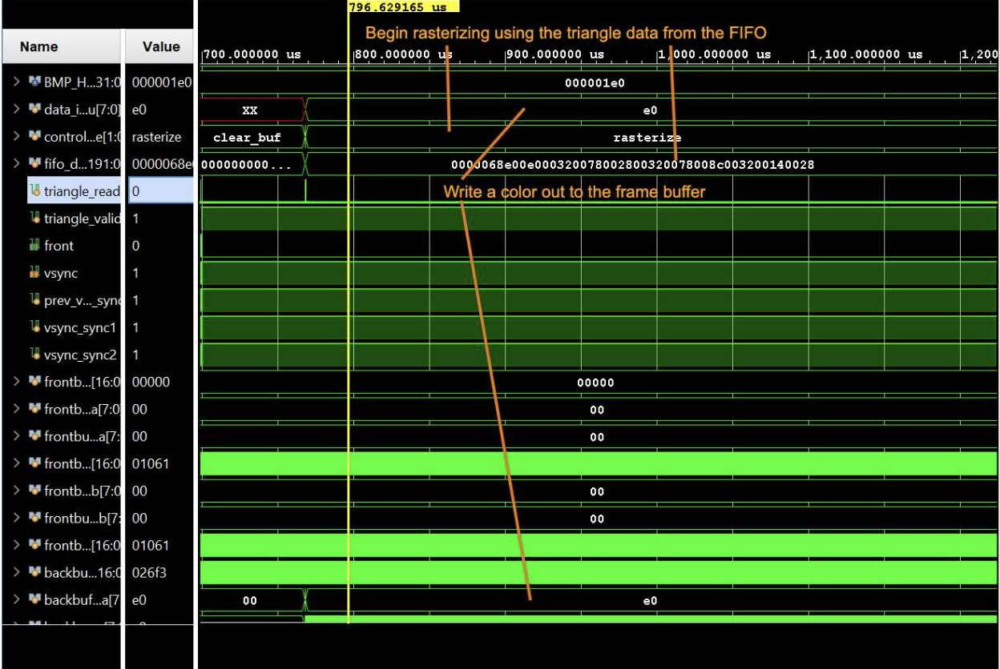
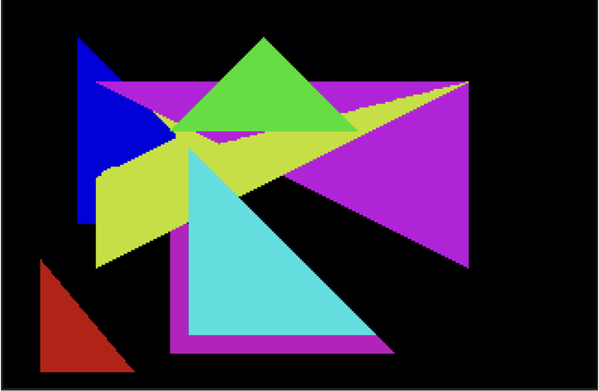

# 3d Polygonal Graphics Processor
## **UIUC ECE 385** Fall 2025 Final Project

Tanmay Garudadri  
Zaheen Jamil  
TA: Boyuan Tian

## Introduction

For our final project, we created a 3d renderer. Given a triangle mesh, it renders the world from arbitrary camera positions and orientations. We choose to render the Cornell Box, a classic environment for graphics testing. This was built as an extension of Lab 7.2. We implemented a framebuffer; we no longer use a fixed-point graphics function. Thus, we have per-pixel-level granularity when drawing to the screen. Of course, this greatly complicated the rendering hardware. As opposed to Lab 7.2, where MicroBlaze simply modified 2400 character locations, MicroBlaze now sends triangle data to hardware, which must then render that triangle, and this happens for every triangle on screen. At a high level, our project can be split into a two-stage process: triangle transformation (software) and triangle drawing (hardware). Triangle transformation is the process of transforming each triangle in world space into camera space and then into raster space. This happens on MicroBlaze. Then, the results of this process are passed on to the triangle drawing phase. Given the vertices of the triangle in screen space, we must draw to the appropriate pixels. This involves iterating through a bounding box and checking if the current iteration should draw using calculated edge equations as well as a z-buffer. This happens entirely in hardware.


## Instructions
1. Import design_sources/* into the hdmi_text_controller custom IP as design sources (replace the top level and AXI files)
2. Import sim_sources/* into the hdmi_text_controller custom IP as simulation sources
3. Import software_sources/* into Vitis. The mesh used in the demo is provided in the header file.
4. Generate bitstream in Vivado, then build and run in Vitis!

### IP Setup.
1. Our double frame buffers use 1 memory address per pixel. Since we are upscaling a 320x240 VGA signal to 640x480, we have 2 frame buffer BRAM modules with 17 bit addresses and a depth of 76800. They must be true dual port, and preloaded with values of 0. Name this IP blk_mem_gen_0.
2. We have a single port zbuffer which has 16 bit wide values. Therefore it has an 18 bit address and a depth of 153600. Name this IP blk_mem_gen_1.
3. We also have a hardware FIFO to coordinate AXI transfers. This way we can queue triangles from the microblaze in the FIFO until the hardware is ready to rasterize them. Initialize this with a write width of 192 bits, and a depth of 32.
4. Clocking wizard inside the hdmi_text_controller IP is set up with 100 MHz input, and one output at 25 MHz (approx. VGA clocking speed) and the other one at 125 MHz (5x clock).

### Microblaze and I/O setup.
1. Set up the microblaze with a 16 Kb memory size. When Vitis has opened, use a following linker flag to increase the runtime stack size to x4000 (without this some functions may not run due to insufficient stack space).
2. To display UART outputs or use the keyboard (not implemented but set up) you must add the AXI UART IP, as well as a few AXI GPIO IPs to set up the keyboard keycode capturing, inturrupt signals and other required IPs. Since we did not implement the keyboard, we will not go into detail on how to set it up.

## Documentation

### Top-Level Block Diagram


This top level is very similar to Lab 7, except for the additional hardware necessary for interfacing with the keyboard over USB and interfacing with the MAX3421E chip over SPI. Here, we configured MicroBlaze to include a basic FPU as well as support for integer division. Otherwise, this is very similar to Lab 6 and Lab 7, so we will not discuss it here and instead move on to our two-stage process. We chose to use MicroBlaze for the triangle transformation phase, as it involved many matrix multiplications and divisions, as well as triangle culling, all of which would significantly complicate the hardware pipeline and control. For small to medium-sized scenes, MicroBlaze would be more than fast enough.

### Triangle Transformation

All of the supporting math was learned from [Scratchapixel](https://www.scratchapixel.com/) and [ogldev.org](http://ogldev.org).  
We will walk through the theory behind the C code that implements the triangle transformation. We define our directions as follows: \+x is right, \+y is up, and \+z is into the screen. The first step is the transformation from world space into camera space by the view matrix:

```
float sin_yaw = sin_lookup(yaw);
        float cos_yaw = cos_lookup(yaw);
        float tx = -(cos_yaw * cam_x + sin_yaw * cam_z);
        float ty = -cam_y;
        float tz = -(-sin_yaw * cam_x + cos_yaw * cam_z);

        const float view_mat[16] = {cos_yaw, 0.0f, sin_yaw,  tx,   
                                    0.0f,    1.0f, 0.0f,     ty,
                                    -sin_yaw, 0.0f, cos_yaw, tz,
                                    0.0f,    0.0f, 0.0f,     1.0f};
```


This matrix, although representing 3d coordinates, is a 4x4 matrix. This is so that translation and rotation can all be done by one matrix multiplication. When 3d vertices are loaded from the mesh, they are given a 4th w coordinate (remember this, it will be used later), which is just 1\. Thus, the transformed vertex will have tx, ty, and tz added to its correct dimensions, respectively. The upper 3x3 portion of this matrix is simply a clockwise rotation about the y-axis (up and down in screen space). The reason why tx, ty, and tz are negative, as well as the fact that the rotation is clockwise rather than counterclockwise, is that this matrix is the inverse of the matrix that moves the camera. For example, if we want to move the camera 5 units to the right and rotate it counterclockwise by 90 degrees, we instead move the entire world left 5 units and rotate the world 90 degrees clockwise.  
The next step is transforming from camera space into clip space through perspective projection:

```
 // ===== PROJECTION MATRIX (for [0, 1] depth) =====
        // Pre-computed for:
        // - FOV: 60 degrees
        // - Aspect ratio: 320/240 = 4/3
        // - Near plane: 1.0
        // - Far plane: 300.0 (to see entire Cornell box at z=0..255)
        //
        // Formula:
        // f = 1/tan(60°/2) = 1/tan(30°) ≈ 1.732
        // m[0][0] = f/aspect = 1.732 / (4/3) = 1.299
        // m[1][1] = f = 1.732
        // m[2][2] = far/(far-near) = 300/(300-1) ≈ 1.003
        // m[2][3] = -(far*near)/(far-near) = -300*1/299 ≈ -1.003
        // m[3][2] = 1.0 (for [0,1] depth, not -1.0)
        // Matrix generated by AI
        // Asked Claude: "Generate a fixed projection matrix assuming I only output to a 320x240 display, my far plane is at z = 300, and FOV = 60"
        const float proj_mat[16] = {1.299f, 0.0f, 0.0f, 0.0f,
                                    0.0f,   1.732f, 0.0f,   0.0f,
                               	0.0f, 0.0f, 1.003f, -1.003f,
                                    0.0f,   0.0f, 1.0f, 0.0f};
```


The role of this matrix is to create a foreshortening effect – objects further away from the camera should look smaller, while objects closer to the camera should look bigger. We can also adjust how much fits into our view, or our Field of View (FOV). We also account for the aspect ratio by scaling the x-axis. We create foreshortening by projecting all vertices onto a 2x2 projection window, as shown below. Note to include more in our FOV, we effectively move further away or closer to the projection window (as opposed to moving the projection window, which would change its dimensions). Thus, our first step is calculating the distance from the camera to the projection window, d. tan(2)=1d , so d=1tan(2).   

From [https://ogldev.org/www/tutorial12/tutorial12.html](https://ogldev.org/www/tutorial12/tutorial12.html)  
Now let us find y’, the projected y. We can use similar triangles to calculate y’. We can see the small triangle below with length d and height y’, but let us also imagine a bigger triangle with length z and height y. These triangles are similar, so y'd=yz, so y'=ydz=ytan(2)z. We can do the exact same for the x coordinate, except we will additionally divide by the aspect ratio to effectively “squeeze” the x-axis by scaling it to fit more x space than y space (assuming an aspect ratio greater than 1), thus x'=xdz=xtan(2)az, where a is the aspect ratio. Dividing by z is commonly known as the perspective divide.  

From [https://ogldev.org/www/tutorial12/tutorial12.html](https://ogldev.org/www/tutorial12/tutorial12.html)  
tan(2)a is a constant, as we know the FOV and aspect ratio (4/3 for 320x240 resolution) before each frame. However, we must divide by z, and this cannot be encoded in a matrix; thus, we divide afterwards.  
Now we have our x and y coordinates in normalized coordinates from \-1 to 1\. However, we want to divide by z afterwards. This was typically hardcoded to happen in the GPU for the x, y, and z coordinates. This meant that the z coordinate would be 1 for all vertices; thus, we can store the original z in w by storing 1 in position \[3,2\] of the matrix. We also want to store a normalized z in the z coordinate. We don’t want to draw objects too close to the camera as this would result in z-fighting, which could create camera inconsistencies. We can also cull objects that are very far away to improve performance. Thus, we define a near plane and a far plane and then solve for a function f(z) \= A \+ Bz, where A is in position \[2, 2\] in the matrix and B is in position \[2,3\]. This function accounts for the perspective divide in z.   
These 2 matrices represent most of the conceptual difficulty of the transformation. Thus, the rest of the code will be explained briefly. Now that we have these 2 matrices, we can compose them together and multiply them by every vertex. After multiplying, we can check that each vertex is within our view (known as frustrum culling). If we had already divided by w (the original z value), this would be checking that x and y are in \[-1, 1\], and that z is in \[0, 1\], but since we haven’t yet, we compare with w instead. If the triangle is outside our viewing space, we don’t send it, further improving performance. We also check if w is very small and skip the triangle if it is. This signifies the object is very close to the near plane, and dividing by 0 will create undefined or infinite values. Now we do the perspective divide and then remap our normalized ranges into \[0, 320\] and \[0, 240\] for our x and y values. We also multiply z by 255 and store all these values as integers to avoid floating-point computation in hardware. We also provide the reciprocal of the area to the hardware for calculating barycentric coordinates, which will be used later. This is calculated by calculating two vertices representing two edges of the triangle, and then taking their cross product and dividing by 2, and finally taking the reciprocal. We used memory-mapped I/O to write these values over AXI.

### Rasterization Hardware

**AXI:**  
The first step of drawing triangles is to properly receive them from MicroBlaze over AXI. For this, we use a modified implementation of Lab 7.1 AXI and a FIFO. From MicroBlaze, we only write 32-bit words, so we don’t implement write strobe logic. In fact, we only use 6 addresses, which we write to sequentially from MicroBlaze. We use a buffer to store the writes to addresses 0-4. Then, on the 5th write, which writes to address 5, we pass the buffer contents along with the current write data into a FIFO, which holds the complete triangle data. 

AXI Receives Data:  
```
slv\_regs\[axi\_awaddr\[ADDR\_LSB\+OPT\_MEM\_ADDR\_BITS:ADDR\_LSB\]\]\[(byte\_index\*8) \+: 8\] \<= S\_AXI\_WDATA\[(byte\_index\*8) \+: 8\];  
        //end  
        fifo\_wr\_en \<= 1'b0;  
        if (axi\_awaddr\[4:2\] \== 3'd5 && \!fifo\_full) begin  
          fifo\_wr\_en \<= 1'b1;  
          fifo\_din \<= {  
              S\_AXI\_WDATA,  // r\_area  
              slv\_regs\[4\],  // color \+ v3z  
              slv\_regs\[3\],  // v3y \+ v3x  
              slv\_regs\[2\],  // v2z \+ v2y  
              slv\_regs\[1\],  // v2x \+ v1z  
              slv\_regs\[0\]   // v1y \+ v1x  
          };
```

The FIFO prevents the rest of the hardware from dropping triangles when it isn’t ready to process them. We implemented a handshake between the first pipeline stage of rasterization and the FIFO. The FIFO is read when the raster pipeline is ready, and the FIFO was not empty on the last cycle (as reads take one cycle).  
This triangle data is then processed, and the packet is unpacked and dispersed to the respective modules. In the C code, we assemble a triangle packet that is 192 bits long. Once it is transmitted through AXI, we can decode it.

C Packet Construction:

```
typedef struct {  
             uint32\_t v0v1;      // Maps to lower 16 bits of addr\[0\]  
             uint32\_t v2v3;      // Maps to lower 16 bits of addr\[1\]  
             uint32\_t v4v5;      // Maps to upper 16 bits of addr\[1\]  
             uint32\_t v6v7;      // Maps to lower 16 bits of addr\[2\]  
             uint32\_t v8color;      // Maps to upper 16 bits of addr\[3\]  
             int32\_t  r\_area;  // Maps to addr\[5\]  
         } TrianglePacket;

System Verilog Deconstruction:  
assign inv\_area \= fifo\_dout\[191:160\];  
assign color \= fifo\_dout\[151:144\];  
assign z3 \= fifo\_dout\[143:128\];  
assign v3y \= fifo\_dout\[119:112\];  
assign v3x \= fifo\_dout\[104:96\];  
assign z2 \= fifo\_dout\[95:80\];  
assign v2y \= fifo\_dout\[71:64\];  
assign v2x \= fifo\_dout\[56:48\];  
assign z1 \= fifo\_dout\[47:32\];  
assign v1y \= fifo\_dout\[23:16\];  
assign v1x \= fifo\_dout\[8:0\];
```

**Top Level Controller:**  
We then enter the triangle processing pipeline. The entry into the pipeline begins with our highest-level triangle controller. This state machine produces the triangle ready signal and also checks for a triangle valid signal. The handshake occurs when both signals are on, and triangle ready is immediately deasserted 1 cycle later. This allows the FIFO read signal to be on for a single clock cycle, only popping a single triangle at a time.   
We always automatically clear all 3 of our buffers from start to finish before any processing. Specifically, our design contains 3 buffers: a double frame buffer, each with an 8-bit width and 76,800 depth, and a 16-bit wide z-buffer with a depth of 76800\.  
Our clear buffer state resets the values of each of these buffers, setting both frame buffers to x00, and setting the z-buffer to 0xFF. This is necessary to do once every frame, otherwise resulting in trails and inaccurate depth information between frames. We must treat each frame as a completely new scene from the hardware point of view, which also means we must send new triangle data every frame from the microblaze.   
Once the buffer clearing has finished, resetting the values of all 3 buffers, we set a special flip-flop that tracks whether we have completed this action to 1\. This way, we will not be flagged to clear the buffers again until we have another vsync falling edge.  
We can then move into the rasterization pipeline. This state machine runs once for each triangle. After drawing a full triangle, we go back to waiting for another one.  

State diagram:  


**Rasterization Part 1: Edge detection (Stages 1 and 2):**  
To begin drawing triangles, we first need a way to figure out whether a particular pixel is inside a triangle. We also need to know which pixels are even worth checking to see if they’re in the triangle, as it would be an incredible waste of time and effort to check every pixel on the screen. To solve both these problems, the first step of drawing a triangle is to create the bounding box and calculate the coefficients for the triangle edges.  
The pipeline controller spends 3 clock cycles in this module. The first cycle is spent latching inputs into the module such that we can support both combinational and sequential calculations with the same data. In the next two cycles, we perform the multiplication necessary to calculate our edge coefficients. Calculating the bounding box is combinational.  
The bounding box is the smallest rectangular box that can fit the entire triangle inside. To calculate the bounding box, we find the smallest x value, smallest y value, biggest x value, and biggest y value out of all 3 vertices of the triangle. We also make sure to cull pixels that will be outside the 320x240 screen in this stage.  
As an example, we show one 3-way comparison performed to find the smallest x value for the bounding box:  
assign temp1 \= (v1x \< v2x) ? v1x : v2x;  
assign bbxi \= (temp1 \< v3x) ? temp1 : v3x;  
assign bbxi \= (bbxi \> 'd320) ? 'd320 : bbxi;  
assign bbxi \= (bbxi \< 'd0) ? 'd0 : bbxi;

Once we have computed the bounding box, we must also compute the coefficients for edge equations.  
A lot of the math used this stack overflow post as a basis: https://stackoverflow.com/questions/2049582/how-to-determine-if-a-point-is-in-a-2d-triangle.

An edge equation looks like this:  
```
Edge(x,y) \= A\*x \+ B\*y \+ C  
A \= y1-y2 \= delta y.  
B \= x2-x1 \= delta x.   
C \= x1\*y2 \- x2\*y1
```

So if Edge(x,y) \>= 0 then the pixel is inside. If all 3 edges are \>= 0, then we should draw the pixel.  
Multiplications take multiple cycles. The best way to force the synthesis to use DSP slices for our multiplication is to add pipeline registers in the multiplication operation. We therefore split this into 2 stages and therefore made it a 2-clock-cycle pipelined process.  
The sequential calculations performed in the module are below:  
Edge v1 to v2.  
a1 \= v1y \- v2y, Takes 1 clock cycle. We do it combinationally after latching the inputs.  
b1 \= v2x \- v1x, Takes 1 clock cycle. We do it combinationally after latching the inputs.  
c1 \= v1x\*v2y \- v2x\*v1y, Takes 2 clock cycles. We do it in 2 stages & handshake.  
Edge v2 to v3.  
a2 \= v2y \- v3y, Takes 1 clock cycle. We do it combinationally after latching the inputs.  
b2 \= v3x \- v2x, Takes 1 clock cycle. We do it combinationally after latching the inputs.  
c2 \= v2x\*v3y \- v3x\*v2y, Takes 2 clock cycles. We do it in 2 stages & handshake.  
Edge v3 to v1.  
a3 \= v3y \- v1y, Takes 1 clock cycle. We do it combinationally after latching the inputs.  
b3 \= v1x \- v3x, Takes 1 clock cycle. We do it combinationally after latching the inputs.  
c3 \= v3x\*v1y \- v1x\*v3y, Takes 2 clock cycles. We do it in 2 stages & handshake.

Similar to the top-level triangle controller, the edge equations module also has two handshaking signals so that calculations begin and end on time, therefore passing accurate values to the next step in the pipeline. To achieve this, we created “edge\_start” and “edge\_done.” Start is asserted by the top-level triangle controller once buffers are cleared and all required information is retrieved from AXI. The edge equations module is then able to latch the correct information and begin processing it. Inside the module, we have 2 logic signals to keep track of the linear pipeline: ready\_s1, ready\_s2. The following controller steps through our pipeline and asserts “edge\_done” once the output information is correct:  
```
always\_ff @(posedge clk) begin  
   if(rst) begin  
       ready\_s1 \<= 0;  
       ready\_s2 \<= 0;  
   end else begin  
       ready\_s1 \<= edge\_start;  
       ready\_s2 \<= ready\_s1;  
   end  
end  
assign edge\_done \= ready\_s2;
```

**Rasterization Part 2: Inside Check & Writing Pixels (Stages 3 to 12 (non-linear)):**  
Our computation then moves into the rasterizer module inside rasterizer.sv. This module contains a 13-state FSM with a non-linear pixel drawing pipeline. It takes the edge equation coefficients and bounding box from the previous module, as well as the inverse area and color from AXI as inputs. As output, it’s able to supply frame buffer and z-buffer reading/writing signals. Therefore, the bulk of our hardware computation takes place inside this module.  
Below is the pseudo-code for this module:  
```
Calculate E1, E2, E3 a single time.  
Edge(x,y) \= A\*x \+ B\*y \+ C

PART 1:  
E1 \= a1\*bbxi \+ b1\*bbyi \+ c1  
E2 \= a2\*bbxi \+ b2\*bbyi \+ c2  
E3 \= a3\*bbxi \+ b3\*bbyi \+ c3

PART 2:  
for(integer y \= bbyi; y \<= bbyf; y\++) begin  
   E1\_row \= E1;  
   E2\_row \= E2;  
   E3\_row \= E3;  
   for(integer x \= bbxi; x \<= bbxf; x\++) begin  
       if(E1\_row \>= 0 && E2\_row \>= 0 && E3\_row \>= 0): CHECK ZBUFFER & Write color.  
       E1\_row \+= a1;  
       E2\_row \+= a2;  
       E3\_row \+= a3;  
   end  
   E1 \+= b1;  
   E2 \+= b2;  
   E3 \+= b3;  
end
```

We first begin with a halt state that begins the handshaking process for the rasterization module. The top-level triangle controller asserts ”rasterizer\_start” once data is ready from the edge module, and this triggers the halt state to move into the edge equation evaluation.  
Like in the pseudo code, we must first compute all three of our edges.   
This requires a multiplication, so we do this in 2 separate cycles: one to compute all 6 products, and another to sum them into our edges. We also must cast these edge coefficients to be signed such that our multiplications also end up signed.  
```
prod1 \<= $signed(a1) \* $signed({1'b0, bbxi});  
prod2 \<= $signed(b1) \* $signed({1'b0, bbyi});  
prod3 \<= $signed(a2) \* $signed({1'b0, bbxi});  
prod4 \<= $signed(b2) \* $signed({1'b0, bbyi});  
prod5 \<= $signed(a3) \* $signed({1'b0, bbxi});  
prod6 \<= $signed(b3) \* $signed({1'b0, bbyi});  
And in another state:  
e1 \<= $signed(prod1) \+ $signed(prod2) \+ $signed(c1);  
e2 \<= $signed(prod3) \+ $signed(prod4) \+ $signed(c2);  
e3 \<= $signed(prod5) \+ $signed(prod6) \+ $signed(c3);
```

We can then begin computing pixels inside the bounding box. Just as in the loop, we must first iterate through each cell of each row, and then every row until we reach the bottom of the bounding box. To accomplish this in hardware, we cache our edge equations for the start of each row and increment it in another state called col\_inc (short for column increment) until we reach the end of the row in the bounding box. We also increment between rows in a state called row\_inc. These states ensure that we cover every pixel in the bounding box.

Inside this loop we must check whether a particular pixel is inside the triangle we are currently drawing or not. This check is made in the “inside\_check” state, which takes the evaluated edge equations and checks whether they are all positive. This looks for clockwise winding of triangle vertices, which automatically completes backface culling. Therefore, if all the edges are positive, then we know that the pixel we are currently looking at is, in fact, inside the triangle we want to draw. If the vertices are arranged in a way that has counterclockwise winding, then we know that we must be looking at a face that is behind our main shape, so we do not draw it.

If we decide that this pixel is, in fact, inside our triangle, we must then check that the pixel wouldn’t already be covered by a triangle that is closer. To check this, we use a z-buffer. But first, we must figure out which z value projects to the current pixel we are at.  
To do this we use barycentric coordinates. In essence, we must find out what the z value is for our x and y coordinates on the triangle. We do not have this information given from microblaze as this would require a bounding box and previous knowledge of what pixels map to what points on the triangle, at which point it might be easier to render everything in software. To do this accurately in hardware, barycentric coordinates take a weighted average of the z coordinates of each vertex and settle on a z value closer to the vertex closest to that point.  
To achieve this in hardware, we multiply our inverse area by our edge equation to find a weight for each edge of our triangle. These come out to be 54 bit w1\_raw, w2\_raw and w3\_raw signed values. We then multiply these by the corresponding z coordinates from each vertex to get 3 71-bit products. We sum these into a calculated z value for our pixel. Since the inverse area was a 32 bit value in 8.24 fixed point format, we must sample only the bottom 8 bits of the non-fractional part and the top 8 bits of the fractional part of this value to go inside our z buffer. This allows plenty of room for intersection tracking down to very precise fractional z values, while also allowing us to track depth up to z values as large as 256\.  
When we have computed the z value for the triangle at this pixel, we can then compare it to the z value stored in the z-buffer. Since reading BRAM has a 1 cycle latency, we introduce a wait state. If our new z value is lower than the previous smallest z value in the buffer, then we should replace it and draw our pixel. If not, we move onto the next pixel.  
If we decide that we should draw this pixel, we address our frame buffer and write the correct color for the triangle.

## Module Descriptions

HDMI Controller Top Level (hdmi\_top\_level.sv):

Inputs: axi\_aclk, axi\_aresetn, \[C\_AXI\_ADDR\_WIDTH-1 : 0\] axi\_awaddr, \[2 : 0\] axi\_awprot, axi\_awvalid, \[C\_AXI\_DATA\_WIDTH-1 : 0\] axi\_wdata, \[(C\_AXI\_DATA\_WIDTH/8)-1 : 0\] axi\_wstrb, axi\_wvalid, axi\_bready, \[C\_AXI\_ADDR\_WIDTH-1 : 0\] axi\_araddr, \[2 : 0\] axi\_arprot, axi\_arvalid,  axi\_bready, \[C\_AXI\_ADDR\_WIDTH-1 : 0\] axi\_araddr, \[2 : 0\] axi\_arprot, axi\_arvalid, axi\_rready  
Outputs: axi\_awready, axi\_wready, \[1 : 0\] axi\_bresp, axi\_bvalid, axi\_arready, \[C\_AXI\_DATA\_WIDTH-1 : 0\] axi\_rdata, \[1 : 0\] axi\_rresp, axi\_rvalid  
Purpose: The purpose of this module is to act as the top-level module for the entire IP. Here we instantiate all of our sub-modules so that we can connect them all and get them working.  
Description: This module contains instantiations of all other modules such as the framebuffer, rasterizer, AXI controller, and all of the other modules that make up the IP. We did not change this file other than removing the instantiation of font\_rom from Lab 7.2.

VGA Controller (VGA\_Controller.sv)  
Inputs: pixel\_clk, reset  
Outputs: hs, vs, active\_nblank, sync, \[9:0\] drawX, \[9:0\] drawY  
Description: This module takes the pixel clock and generates an hsync signal, a vsync signal, and outputs the current DrawX and DrawY value that the color mapper should be outputting RGB values for.  
Purpose: This module keeps all the display hardware in sync using the pixel clock. It also tells the color mapper when we’ve finished a row and are about to move to the next (hsync on, so draw blanks) or when we’ve finished a frame and are about to move to the next (vsync on, so draw blanks). It also tells the entire system which pixel we’re currently drawing using the DrawX and DrawY values. This is unchanged from Lab 7\.

HDMI Text Controller AXI Module (hdmi\_top\_level\_axi.sv)  
Inputs: vsync, \[9:0\] drawX, \[9:0\] drawY, S\_AXI\_ACLK, S\_AXI\_ARESETN, \[C\_S\_AXI\_ADDR\_WIDTH-1 : 0\] S\_AXI\_AWADDR, \[2 : 0\] S\_AXI\_AWPROT, \[C\_S\_AXI\_DATA\_WIDTH-1 : 0\] S\_AXI\_WDATA, \[(C\_S\_AXI\_DATA\_WIDTH/8)-1 : 0\] S\_AXI\_WSTRB, S\_AXI\_WVALID, S\_AXI\_BREADY, \[C\_S\_AXI\_ADDR\_WIDTH-1 : 0\] S\_AXI\_ARADDR, \[2 : 0\] S\_AXI\_ARPROT, S\_AXI\_ARVALID, S\_AXI\_RREADY  
Outputs: \[3:0\] red, \[3:0\] green, \[3:0\] blue, S\_AXI\_AWVALID, S\_AXI\_AWREADY, S\_AXI\_WREADY, \[1 : 0\] S\_AXI\_BRESP, S\_AXI\_BVALID, S\_AXI\_ARREADY, \[C\_S\_AXI\_DATA\_WIDTH-1 : 0\] S\_AXI\_RDATA, \[1 : 0\] S\_AXI\_RRESP, S\_AXI\_RVALID,  
Description: This module contains all the AXI host handshaking logic for reads and writes, as well as the functionality of the color mapper.  
Purpose: This module is used to allow Microblaze to write into the FIFO with memory-mapped I/O. Additionally, this module provides RGB values to the VGA to HDMI module. We modified slv\_regs to be only 8 registers, and added logic to have slv\_regs input into the FIFO when appropriate. The colors are now simply read out of the framebuffer per pixel, and there are no palette registers. It also contains the main FSM for controlling the pipeline.

Edge Equation and Bounding Box Module (edge\_eq\_bb.sv)  
Inputs: clk, rst, \[8:0\] v1x\_in, \[8:0\] v2x\_in, \[8:0\] v3x\_in, \[7:0\] v1y\_in, \[7:0\] v2y\_in, \[7:0\] v3y\_in, edge\_start  
Outputs: edge\_done, signed \[9:0\] a1, signed \[9:0\] b1, signed \[9:0\] a2, signed \[9:0\] b2, signed \[9:0\] a3, signed \[9:0\] b3, signed \[17:0\] c1, signed \[17:0\] c2, signed \[17:0\] c3, \[8:0\] bbxi, \[8:0\] bbxf, \[7:0\] bbyi, \[7:0\] bbyf  
Description: This module contains the logic for generating a bounding box and the 3 edge equations given a set of a triangle’s vertices. It has a delay of one clock cycle.  
Purpose: This module provides the pipeline pixels over. It turns from abstract triangle vertices into pixels, which may or may not need to be set to a certain color.

Framebuffer (framebuffer.sv):  
Inputs: clk, vsync, rst, wea, \[ADDR\_WIDTH-1:0\] addra, \[7:0\] dina, \[ADDR\_WIDTH-1:0\] addrb  
Outputs: \[7:0\] doubt, front  
Description: This module instantiates and abstracts two memories to hold two buffers for double buffering. It swaps buffers on every vsync to allow us to start generating the next frame while the previous one is being read (i.e. write to the framebuffer outside of vblank).  
Purpose: This module functions as the write buffer for our pipeline. It can be overwritten in the same area many times to allow for overlapping triangles (or even one triangle completely covering another). It also functions as the read buffer for vga controller.

Rasterizer (rasterizer.sv):  
Inputs: clk, rst, \[31:0\] inv\_area, \[7:0\] color, signed \[9:0\] a1, signed \[9:0\] b1, signed \[9:0\] a2, signed \[9:0\] b2, signed \[9:0\] a3, signed \[9:0\] b3, signed \[17:0\] c1, signed \[17:0\] c2, signed \[17:0\] c3, \[8:0\] bbxi, \[8:0\] bbxf, \[7:0\] bbyi, \[7:0\] bbyf, \[15:0\] z1, \[15:0\] z2, \[15:0\] z3, rasterizer\_start, \[7:0\] zbuf\_dout  
Outputs: rasterizer\_done, write\_enable\_gpu, \[7:0\] data\_in\_gpu, \[16:0\] addr\_gpu, \[16:0\] zbuf\_addr, \[7:0\] zbuf\_din, zbuf\_we  
Description: This is the main rasterizing module which loops through the bounding box and colors the triangle.  
Purpose: The purpose of this module is to iterate through the bounding box and decide whether to draw each pixel. This module handles checking whether each pixel is inside the triangle, and whether it’s already being covered by something else before writing the correct color value to the frame buffer.

HDMI Text Controller (C file):  
Description: This code contains the logic to transform the triangle mesh into screen space triangles.  
Purpose: This code passes triangles to the rendering hardware through a FIFO, one triangle at a time.

HDMI Text Controller (H file):  
Description: This module contains the (AI-generated Cornell Box) triangle mesh that we chose to use. It also contains function declarations and the sin lookup table.  
Purpose: This allows us to easily set the triangle mesh.

## Simulations

### Triangle Transformation

The following outputs come from this testbench. It generates a wireframe image where the borders of the triangle are colored rather than the whole triangle for better visibility. This testbench is partially AI-generated. I asked Claude to generate a testbench that uses my Cornell Box mesh and the logic in my main function from hdmi\_text\_controller.c to create an output image. I ran this test using three different camera locations.
cam\_x \= 127.5, cam\_y \= 127.5, cam\_z \= \-20, yaw \= 0:


cam\_x \= 127.5, cam\_y \= 127.5, cam\_z \= \-20, yaw \= /12:


cam\_x \= 127.5, cam\_y \= 127.5, cam\_z \= \-20, yaw \= 3/4:


These different images display the world from the perspective of the aforementioned coordinates and camera orientations. We see that we successfully generate all triangles that might need to be drawn from a given point of view. In the last image, the small cube renders despite being fully behind the large cube. This is a result of z-buffering not being done in software but in hardware, and it is intended behavior.

### Triangle Drawing
Buffer clearing annotated simulation:


Handshaking annotated simulation:


Rasterizer writing frame buffer annotated simulation:


Result of axi\_tb.sv:


Provided vertices:

       // Triangle 1: Red (Bottom Left) \- Farther Back (Z=50)  
       draw\_triangle(  
           9'd40, 8'd20,    // V1  
           9'd140, 8'd120,  // V2  
           9'd40, 8'd120,   // V3  
           8'hE0,           // Red (RGB332: 111\_000\_00)  
           16'd50, 16'd50, 16'd50  
       );

       // Triangle 2: Green (Top Middle) \- Closer (Z=10). \*\*FIXED CW/CCW Winding\*\*  
       draw\_triangle(  
           9'd140, 8'd20,   // V1  
           9'd190, 8'd70,   // V2 (Swapped from original to fix winding)  
           9'd90, 8'd70,    // V3 (Swapped from original to fix winding)  
           8'h1C,           // Green (RGB332: 000\_111\_00)  
           16'd10, 16'd10, 16'd10  
       );

       // Triangle 3: Blue (Top Left) \- Z Gradient (Z=10 to 100\)  
       draw\_triangle(  
           9'd20, 8'd140,  
           9'd70, 8'd200,  
           9'd20, 8'd200,  
           8'h03,           // Blue (RGB332: 000\_000\_11)  
           16'd10, 16'd100, 16'd10  
       );  
        
       // \--- NEW OVERLAPPING TRIANGLES \---

       // Triangle 4: Cyan (Overlapping Center) \- \*\*VERY CLOSE (Z=5)\*\*  
       // This will be drawn LAST in the FIFO and should overwrite all others.  
       draw\_triangle(  
           9'd100, 8'd80,   // V1  
           9'd200, 8'd180,  // V2  
           9'd100, 8'd180,  // V3  
           8'hFC,           // Yellow (RGB332: 111\_111\_00)  
           16'd5, 16'd5, 16'd5  
       );  
        
       // Triangle 5: Magenta (Overlapping Yellow) \- \*\*VERY FAR (Z=100)\*\*  
       // This will be drawn AFTER Yellow, but should be hidden by the Z-buffer.  
       draw\_triangle(  
           9'd90, 8'd70,    // V1  
           9'd210, 8'd190,   // V2  
           9'd90, 8'd190,   // V3  
           8'hC3,           // Magenta (RGB332: 110\_000\_11)  
           16'd100, 16'd100, 16'd100  
       );

       draw\_triangle(  
           9'd50,  8'd300,   // V1 (Left)  Z=10  
           9'd250, 8'd300,   // V2 (Right) Z=90  
           9'd50,  8'd400,   // V3 (Left)  Z=10  
           8'h1F,            // Cyan  
           16'd10, 16'd90, 16'd10  
       );

       // Triangle B: Magenta (Slopes Z: High \-\> Low)  
       draw\_triangle(  
           9'd50,  8'd300,   // V1 (Left)  Z=90  
           9'd250, 8'd300,   // V2 (Right) Z=10  
           9'd250, 8'd400,   // V3 (Right) Z=10  
           8'hE3,            // Magenta  
           16'd90, 16'd10, 16'd10  
       );

The yellow triangle has a z gradient (bottom vertex has very small Z, top edge has very large Z). It intersects with the other triangles on a per-pixel basis when the other triangles have a smaller z, showing working z-buffer functionality.

## Design Resources and Statistics

## 

| LUTs | 5,103 |
| :---- | :---- |
| DSP | 20 |
| Memory (BRAM) | 74 |
| Flip-Flop | 3989 |
| Latches | 0 |
| Frequency | 105.218 MHz |
| Static Power | 0.076W |
| Dynamic Power | 0.419W |
| Total Power | 0.495W |

## Difficulties

### Triangle Transformation

Overall, the software was by far easier to debug. Here are the biggest issues we faced when implementing software on the MicroBlaze.

1. We could not get the keyboard to work. We set up the SPI and USB hardware in the block design exactly as lab 6 specified and used our working SPI functions from Lab 6\. After debugging, we realized that MAX3421E\_init() was failing somehow, as no code after it would ever run. From  this point, we were not sure exactly how to debug other than by checking that our block design was correct. Thus, to showcase the dynamic rendering within the timeframe, we instead switched to creating a path for the camera to follow.  
2. We were incorrectly using memory-mapped I/O within the MicroBlaze. For a while, we were using a struct like this:
	We figured that since in Lab 7, we were able to access the VRAM as an array of bytes, we should be able to do similarly here. However, it did not work, even with the packed attribute. Eventually, we switched to having a struct with only 32-bit fields. This ended up wasting quite a bit of time because we didn’t know whether there was a problem with our AXI handshaking logic (as in Lab 7, this worked in simulation but not hardware), and assumed that it was the handshaking logic at fault.

3. We had many miscellaneous Vitis errors. The biggest problem was Vitis on Tanmay’s computer throwing an error about an invalid platform, which meant he could not test on hardware for a while. Zaheen eventually had similar issues and had to spend at least 2 hours debugging, and ended up having to change Makefiles in Vitis manually to get it to work.  
4. One unexpected issue was that MicroBlaze cannot compute trigonometric functions even with the FPU enabled. It would silently fail (and stop all output, including previous outputs, to the serial terminal somehow) when called. This required us to consider approximating them instead, but we ultimately ended up using a size 256 lookup table to store sin values. This allowed us to skip computation while not using too much memory.  
5. While developing the logic in the first place (before even running on MicroBlaze), we had an issue with the logic hanging forever. It turns out that this happened when w was close but not equal to 0, causing floating point errors with future divisions and creating NaNs.

### Triangle Drawing

**AXI**  
We had to perform a careful balancing act of deciding which information to compute on the microblaze and which information we could compute in hardware. One of the main things that was considered was the size of the packet we would send through AXI. The size we landed on was 192 bits, but we floated larger and smaller packets, thinking of how many clock cycles it would take each packet to transfer and how much the microblaze could handle. After trial and error we found the optimal amount of information for the microblaze to transmit to hardware: projected x,y,z of 3 vertices, inverse area, and color.  
**Clock domain crossing**  
At times, usage of multiple clocks in logic caused clock domain crossing issues, where when we tried detecting the falling edge of vsync in order to switch frame buffers, our logic often missed the edge which ran on a clock 4 times slower. This resulted in us having to research and implement a clock domain crossing solution which synchronized the pixel clock with the main 100 MHz clock in multiple areas of the code to ensure that edges were detected correctly and that we were able to swap our frame buffers and clear them appropriately.  
**Floating point issues**  
Many hours were spent debugging floating point and bit width issues, where each multiplication and addition operation had to be put into logic signals that were appropriately sized. In addition, we could not resize signals randomly, as sometimes the bulk of the significant data was in an arbitrary location.  
For example, to fix a 71 bit multiplication problem, we tried to resize one of our products to 46 bits, and therefore resize one weight to 30 bits. Although this design could now fit inside a DSP48 module, it turned out that many significant bits for the barycentric weights for triangles in the ranges of z between 100-250 were excluded with this operation. This resulted in very inaccurate triangle drawing for specific areas of the 3d mesh, while other areas were drawn fine. These issues were extremely difficult to track and test for, causing many hours of debugging, trial and error.  
Fixing these issues required extending precision, and therefore product widths in DSPs and trying to earn time back in other areas to ensure we still drew enough triangles to render a scene.  
**Resource usage**  
During the entire project, we were approaching the hardware limit of BRAM usage. With 2 8-bit frame buffers sized 76.8 kB, a z-buffer sized 76.8 kB, a 192 bit wide FIFO, a microblaze, and overhead, we received resource overutilization errors multiple times, having to redesign parts of the project to cut usage.  
**Pipelining and timing**  
Our multiplications required DSP usage in order to avoid failing timing and having an unsustainable worst negative slack. In order to achieve this, we had to build a non-linear pipeline where we stored each multiplication operand and product in a pipeline register to encourage the synthesizer to use a DSP. Even still, we had multiple errors to deal with including DRC violations due to the very wide (71 bit) multiplications that some of our calculations were forced to perform. Fixing these errors and allowing the DSP modules to synthesize correctly was difficult. In the end, however, we were able to achieve a fantastic worst negative slack of 0.6 nS, which was in fact within the 10 nS clock period, ensuring no issues with setup time violations.